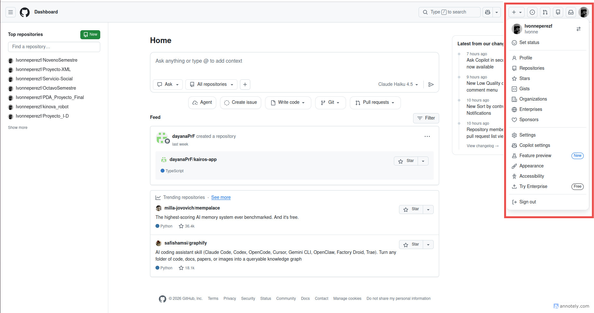
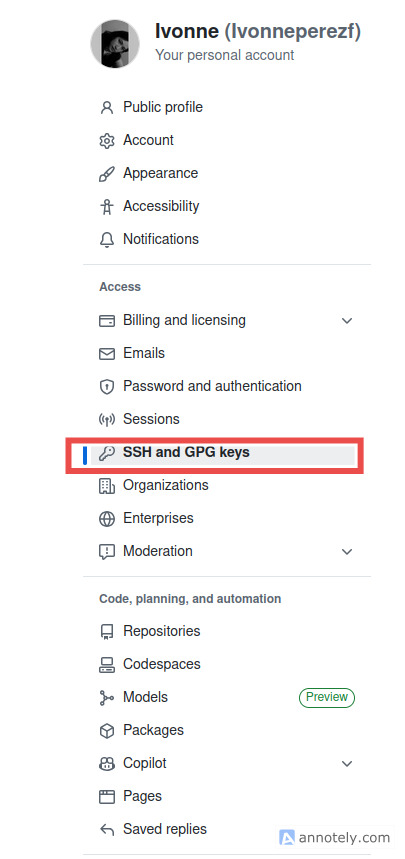
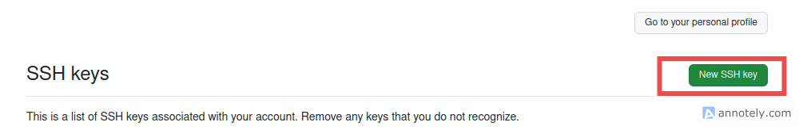
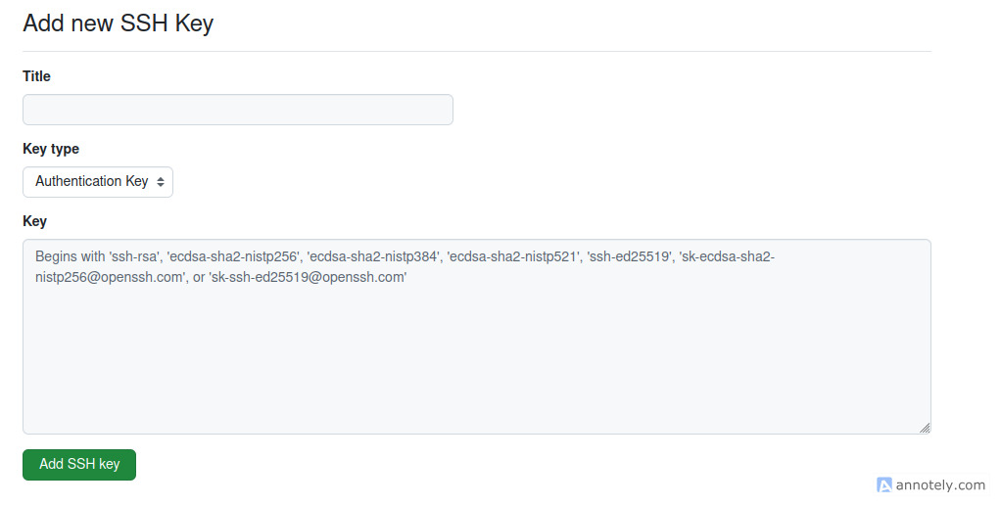

# PROYECTO DE ROBOT DETECTOR DE GRIETAS

Hola, esta información del archivo [README.md](https://github.com/Ivonneperezf/robot_movil_terrestre/blob/main/README.md) es para que pueda servirles de guia inicial y puedan visualizar los recursos necesarios.
Es necesario mencionar que este archivo NO DEBE EDITARSE.

## Requisitos previos
* Tener instalado la versión [Noetic de ROS](https://wiki.ros.org/noetic/Installation/Ubuntu), el cual es soportado por [Ubuntu 20.04 focal fossa](https://ubuntu.com/20-04)
  
  **Nota. En caso de ya estar trabajando con ROS 2, dar click [aqui](https://github.com/Ivonneperezf/robot_movil_terrestre_ROS2)** 

## Configuración de Git y GitHub

Para la configuración de inicial de git deben de seguirse los siguientes pasos, en caso de tener problema apoyarse de alguna herramienta de IA o pueden preguntarme.

1. **Verificar la instalación de git**

   En sistemas operativos como Ubuntu git ya se encuentra instalado, para verificar ejecutar el comando:

   ```bash
   git --version
   ```

   En caso de no tener instalado git, procedemos a realizar la instalacion:
   ```bash
   # Actualizacion del sistema
   sudo apt update
   # Instalacion de git 
   sudo apt install git
   # Verificacion de instalacion
   git --version
   ```

2. **Creación y configuración de llave local y pública**
   Para esta parte necesitamos verificar si en la raiz de nuestro sistema se encuentra la carpeta ***.ssh***, por lo que accedemos a la raiz y consultamos esa información con el comando ***ls***:

   ```bash
   cd ~
   ls
   ```

   En caso de no existir crear la carpeta con el siguiente comando:

   ```bash
   mkdir .ssh
   ```

   Posteriormente procederemos a crear la llave local. Para crearla ejecutamos el siguiente comando:

   ```bash
   ssh-keygen -t ed25519 -C "correo@correo.com"
   ```

   Posteriormente, nos pedirá el nombre de la llave local y una contraseña, por lo que proporcionaremos algún nombre y una contraseña que podamos recordar.

   Ahora realizaremos la configuración local de llave privada para conexión vía ssh con los siguientes comandos:

   ```bash
   # Lanzamos el agente
   eval "$(ssh-agent -s)"
   # agregamos la llave local (nos pedira la contraseña creada anteriormente, por lo que la proporcionamos)
   ssh-add nombre_de_la_llave
   ```

   Ahora, debemos configurar la llave para el repositorio público, por lo que primero debemos acceder a nuestra cuenta de [GitHub](https://github.com/), una vez dentro hacemos click en nuestra foto de perfil y accedemos a **settings**.

   

   Una vez en la configuración, entramos al apartado **SSH and GPG keys**.

   

   Damos click en el boton **New SSH key**

   

   Regresamos a la terminal local y ejecutamos el siguiente comando para visualizar el contenido de la llave local

   ```bash
   cat nombre_de_la_llave.pub
   ```

   La salida que obtengamos la copiamos.

   Posteormente, pegamos la llave en la sección key, de igual manera y preferentemente colocamos el mismo nombre de la llave local y en la pública, finalmente, mantenemos el mismo tipo de llave y la agregamos.

   

   ***NOTA IMPORTANTE.*** En caso de no poder inicial por problemas de llaves cada vez que se intente usar git, ejecutar los siguientes comandos
   ```bash
   cd ~/.ssh
   eval "$(ssh-agent -s)"
   ssh-add nombre_de_la_llave
   ```
   